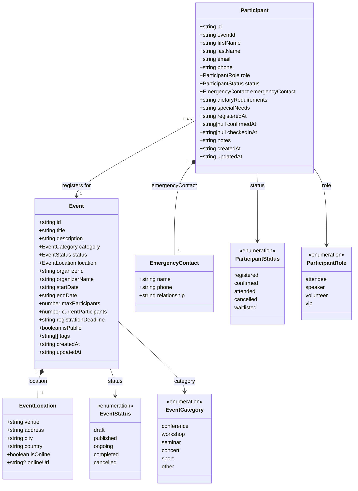

# UML Diagram - Event Management System

## ความสัมพันธ์

| ความสัมพันธ์ | ประเภท | คำอธิบาย |
|-------------|--------|---------|
| Event → EventLocation | Composition (★) | Event มี Location 1 อัน ถ้าลบ Event ข้อมูล Location หายด้วย |
| Event → EventStatus | Dependency | Event ใช้ค่าจาก enum EventStatus |
| Event → EventCategory | Dependency | Event ใช้ค่าจาก enum EventCategory |
| Participant → Event | Association | Participant หลายคนลงทะเบียนใน Event 1 งาน |
| Participant → EmergencyContact | Composition (★) | Participant มี EmergencyContact 1 อัน |
| Participant → ParticipantStatus | Dependency | Participant ใช้ค่าจาก enum ParticipantStatus |
| Participant → ParticipantRole | Dependency | Participant ใช้ค่าจาก enum ParticipantRole |